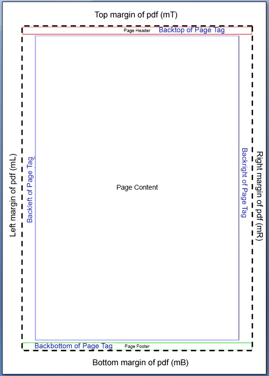

# Page Management

[back](./README.md)

To facilitate the layout, three specific tags have been added:
 
  * `<page>`
  * `<page_header>`
  * `<page_footer>`
  
They must be used as follow:

```html
 <page> 
    <page_header> 
       ...              
    </page_header> 
    <page_footer> 
       ...
    </page_footer> 
    ...
 </page> 
```

You **must not** use `<body>` and `<html>` tags.

## Page tag

### Attributes

You can use the main following attributes:

Attribute| Default | Description
---------|---------|-------------
pageset | new | Specify if we want to use the previous page definition (old) or a new one (new)
pagegroup | old | Specify if we are in the same page group (old) or in a new one (new)
hideheader | | comma-separate page numbers on which we want to hide the header
hidefooter | | comma-separate page numbers on which we want to hide the footer
orientation | | Portrait (P) or Lanscape (L). By default, the orientation specified in the Html2Pdf constructor
format | | Format to use The list of the available values are [here](https://github.com/tecnickcom/TCPDF/blob/master/include/tcpdf_static.php#L2097). By default, the orientation specified in the Html2Pdf constructor
style | | css style
class | | css class

You can use the following attributes to manage page margin:

Attribute| Default | Description
---------|---------|-------------
backtop | 0 | value with unit (mm, px, pt, % )
backbottom | 0 | value with unit (mm, px, pt, % )
backleft | 0 | value with unit (mm, px, pt, % )
backright | 0 | value with unit (mm, px, pt, % )

You can use the following attributes to manage page background:

Attribute| Default | Description
---------|---------|-------------
backcolor | transparent | css color value
backimg | | url of the image to use
backimgx | center | x position of the image on the page background: left / center / right / value with unit (mm, px, pt, % )
backimgy | middle | y position of the image on the page background: top / middle / bottom / value with unit (mm, px, pt, % )
backimgw | 100% | width on the image on the page background: value with unit (mm, px, pt, % )

You can add a light footer by using the attribute footer. It takes coma-separated values:

Value| Description
-----|-------------
page | display the current page
date | display the generation date
time | display the generation time
form | display a disclamer about form compatibility

### explanation

It allows to define, for the entire html code included within the layout :

  * margins left, right, top, bottom (backleft, backright, backtop, backbottom)
  * background image, with its position and size (backimg, backimgx, backimgy, backimgw)
  * the background color (backcolor)
  * orientation (orientation) and format (format)
  * simple automatic footer (footer)
  * a header and a footer complex HTML (using tags page_header and page_footer).

It does not limit it-self to one final page of the PDF, but to a set of pages.

Any HTML code will be included automatically within the same layout.

It is possible to reuse the layout of the previous tag page using property pageset = “old.” This also automatically resume the header and the footer. 

## Page Header tag

Its allows you to use complex HTML as the header of the current page.

Its definition must necessarily be located just after the opening of the `<page>` tag.

It can contain any valid HTML.

It is **REQUIRED** to specify the top margin, using the `backtop` attribute on the `<page>` tag. 

You can use ̀`css` and `class` attribute on this specific tag.

## Page Footer tag

Its allows you to use complex HTML as the header of the current page.

Its definition must necessarily be located just after the opening of the `<page>` tag.

It can contain any valid HTML.

It is **REQUIRED** to specify the top margin, using the `backtop` attribute on the `<page>` tag.

You can use `css` and `class` attribute on this specific tag.

## Margin Explanation

Here's a little explanation of different margins:

```html
<page backtop="7mm" backbottom="7mm" backleft="10mm" backright="10mm"> 
    <page_header> 
         Page Header 
    </page_header> 
    <page_footer> 
         Page Footer 
    </page_footer> 

    Page Content 
</page> 
```

```php
$pdf = new \Spipu\Html2Pdf\Html2Pdf('P','A4','en', false, 'UTF-8', array(mL, mT, mR, mB)); 
$pdf->writeHTML($htmlContent); 
$pdf->Output(); 
```



[back](./README.md)
